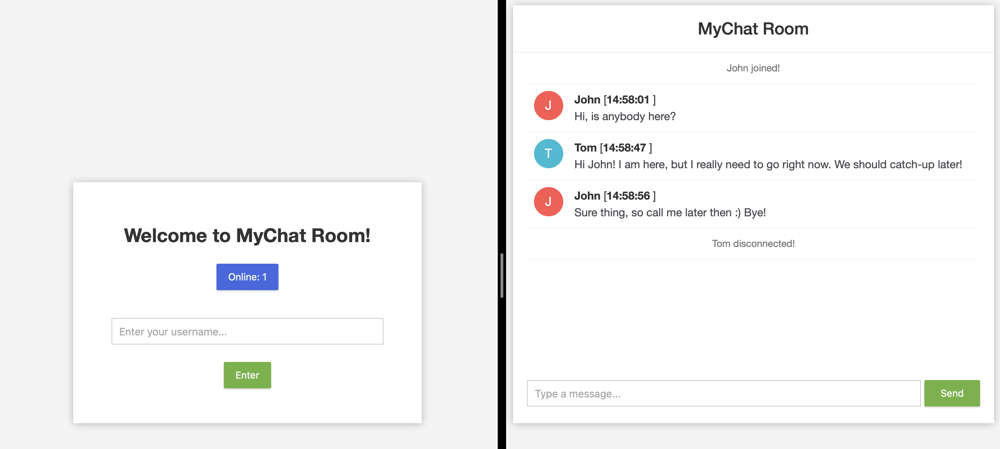
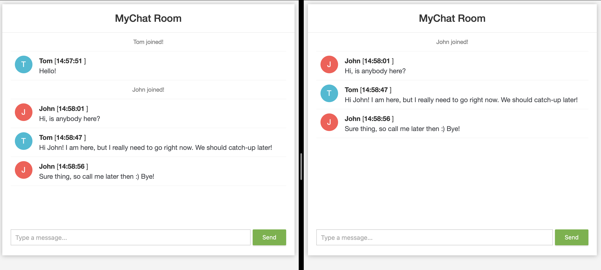

# 🚀 MyChat-Room

* [📝 Description](#description)
  * [Overview](#overview)
  * [Discover the Features](#features)
* [🔧 Technologies & Frameworks](#technologies)
* [📸 Screenshots](#screenshots)
* [📋 TO-DO List](#todo)
##  📝 Description

###  Overview
Welcome to MyChat-Room - a real-time chat application powered by network programming and the TCP protocol.

This project has been a valuable learning experience in the realm of network programming, providing insights into the world of real-time communication. Although the application is in its early stages, it already facilitates seamless, instant conversations. Explore the "Key Features" to get a glimpse of the current capabilities, and check the "TO-DO" section for upcoming enhancements.

The inspiration for this project arose from a desire to delve into network programming and create a dynamic platform for real-time communication.

###  Discover the Features

MyChat-Room provides features such as:

* 🔄 Real-time Conversations: Users can engage in seamless, real-time conversations using the power of WebSockets and the TCP protocol.

* 🚀 Network Programming: Dive into the world of network programming with Java 17, gaining valuable knowledge on the intricacies of communication over the internet.

* 🌐 User-Friendly Interface: The application is crafted with JavaScript, HTML, and CSS to ensure an intuitive and visually appealing user experience.

* 🛡️ Secure Communication: Leveraging the TCP protocol, our chat application ensures secure and reliable communication.

These features converge to create a dynamic and engaging chat experience! 🌐💬

##  🔧 Technologies & Frameworks

MyChat-Room is built with a blend of cutting-edge technologies:

🚀 Backend:

* Java 📚
* Spring Boot 🏃
* TCP Protocol 🌐
* WebSockets 🚀
* JavaScript 🪄
* Maven 🛠️
* Project Lombok 🧰

🎨 Frontend:

* HTML 🌐
* CSS 🎨
* JavaScript 🌼 (just a little :))

These technologies converge to provide a robust foundation for our real-time chat application.

##  📸 Screenshots

* #### Welcome screen & active chat

 

* #### Live chat room (connecting, disconnecting, messaging)

##  📋 TO-DO List

- [x] Implement real-time chat functionality using WebSockets.
- [x] Explore network programming principles with Java 17.
- [x] Design a user-friendly interface with JavaScript, HTML, and CSS.
- [ ] Implement user authentication for secure communication.
- [ ] Enhance chat features, such as message formatting and multimedia support.
- [ ] Explore options for group chats and private messaging.
